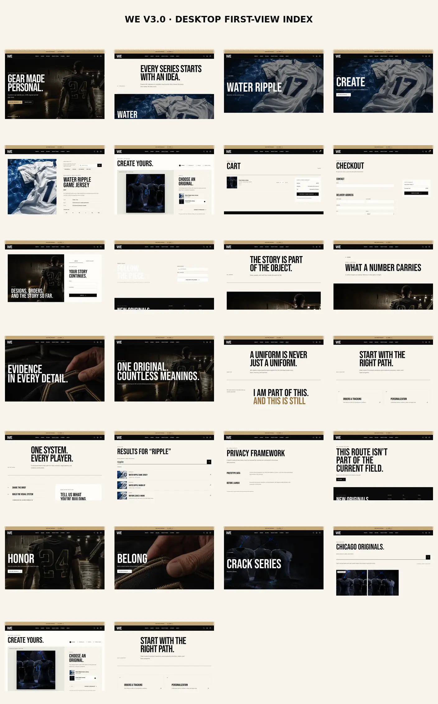
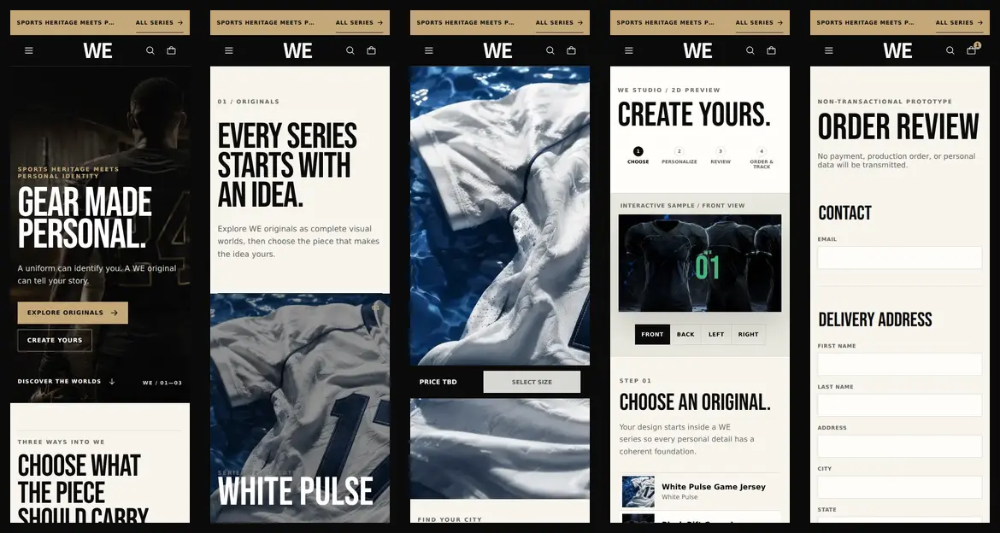

# WE V3.0 网站全页面预览

本目录是 V3.0 网站需求的可执行视觉基线。预览来自真实 React 路由的浏览器渲染，不是静态线框拼图。

- 桌面端：26 张，视口 1440 × 1000，完整页面截图。
- 移动端：5 张，视口 390 × 844，完整页面截图。
- 浏览器验证：31 / 31 通过；每页均含唯一 H1、`#main-content` 主内容区、有效正文，且无运行时页面错误或 Vite 错误遮罩。
- 字体：标题 Bebas Neue；正文 Roboto；CJK 回退 Noto Sans / Noto Sans CJK SC。
- 品牌：面向用户的品牌统一为 WE；仅 Create 页法律免责声明保留需求指定的 `WE UNION` 原文。
- 导航：无 SHOP、无 SHOP BY SPORT。
- 商品发现：Collection Gateway 采用“一行一个系列”的全宽主题带；商品网格仅存在于系列列表页。

## 总览





## V01–V19 核心页面

| 编号 | 页面 | 路由 | 完整预览 |
|---|---|---|---|
| V01 | Homepage | `/` | [01-homepage.webp](desktop/01-homepage.webp) |
| V02A | Collection Gateway | `/collections` | [02-collection-gateway.webp](desktop/02-collection-gateway.webp) |
| V02B | Series Product List | `/collections/water-ripple` | [03-series-list.webp](desktop/03-series-list.webp) |
| V03 | World Landing / Create | `/create` | [04-world-create.webp](desktop/04-world-create.webp) |
| V04 | Product Detail + FIND YOUR CITY | `/products/water-ripple-game-jersey` | [05-product-detail.webp](desktop/05-product-detail.webp) |
| V05 | Create Studio + IP Disclaimer | `/custom` | [06-create-studio.webp](desktop/06-create-studio.webp) |
| V06 | Cart | `/cart` | [07-cart.webp](desktop/07-cart.webp) |
| V07 | Checkout | `/checkout` | [08-checkout.webp](desktop/08-checkout.webp) |
| V08 | Account | `/account` | [09-account.webp](desktop/09-account.webp) |
| V09 | Order Tracking | `/track` | [10-order-track.webp](desktop/10-order-track.webp) |
| V10 | Stories | `/stories` | [11-stories.webp](desktop/11-stories.webp) |
| V11 | Story Detail | `/stories/the-number-24` | [12-story-detail.webp](desktop/12-story-detail.webp) |
| V12 | Craftsmanship | `/craftsmanship` | [13-craftsmanship.webp](desktop/13-craftsmanship.webp) |
| V13 | Community | `/community` | [14-community.webp](desktop/14-community.webp) |
| V14 | About | `/about` | [15-about.webp](desktop/15-about.webp) |
| V15 | Support | `/support` | [16-support.webp](desktop/16-support.webp) |
| V16 | Team Orders | `/custom/team` | [17-team-orders.webp](desktop/17-team-orders.webp) |
| V17 | Search | `/search?q=ripple` | [18-search.webp](desktop/18-search.webp) |
| V18 | Policy | `/legal/privacy` | [19-policy.webp](desktop/19-policy.webp) |
| V19 | Not Found | `/not-a-real-route` | [20-not-found.webp](desktop/20-not-found.webp) |

## 关键页面变体

| 页面 | 路由 | 完整预览 |
|---|---|---|
| World Landing / Honor | `/honor` | [21-world-honor.webp](desktop/21-world-honor.webp) |
| World Landing / Belong | `/belong` | [22-world-belong.webp](desktop/22-world-belong.webp) |
| Crack Series Product List | `/collections/crack` | [23-crack-series-list.webp](desktop/23-crack-series-list.webp) |
| City Discovery Results | `/search?city=chicago` | [24-city-results.webp](desktop/24-city-results.webp) |
| Saved Design State | `/custom/saved/demo` | [25-saved-design.webp](desktop/25-saved-design.webp) |
| FAQ Route | `/faq` | [26-faq.webp](desktop/26-faq.webp) |

## 移动端关键路径

| 页面 | 完整预览 |
|---|---|
| Homepage | [01-homepage-mobile.webp](mobile/01-homepage-mobile.webp) |
| Collection Gateway | [02-collection-gateway-mobile.webp](mobile/02-collection-gateway-mobile.webp) |
| Product Detail + FIND YOUR CITY | [05-product-detail-mobile.webp](mobile/05-product-detail-mobile.webp) |
| Create Studio + Disclaimer | [06-create-studio-mobile.webp](mobile/06-create-studio-mobile.webp) |
| Checkout | [08-checkout-mobile.webp](mobile/08-checkout-mobile.webp) |

## 重现与验收

```bash
npm ci
npm run check
npm test
npm run audit:source
npm run smoke:routes
npm run build
npm run preview:capture
```

`preview:capture` 会启动隔离的 Vite 开发服务器，使用 Chromium 逐页加载字体与图片、滚动触发懒加载，再生成完整 WebP 页面截图和 [verification.json](verification.json)。裂纹系列视觉为本预览分支的原创概念素材，不含联盟、球队、运动员或第三方品牌标识；正式上线前应由品牌完成最终素材审定。
